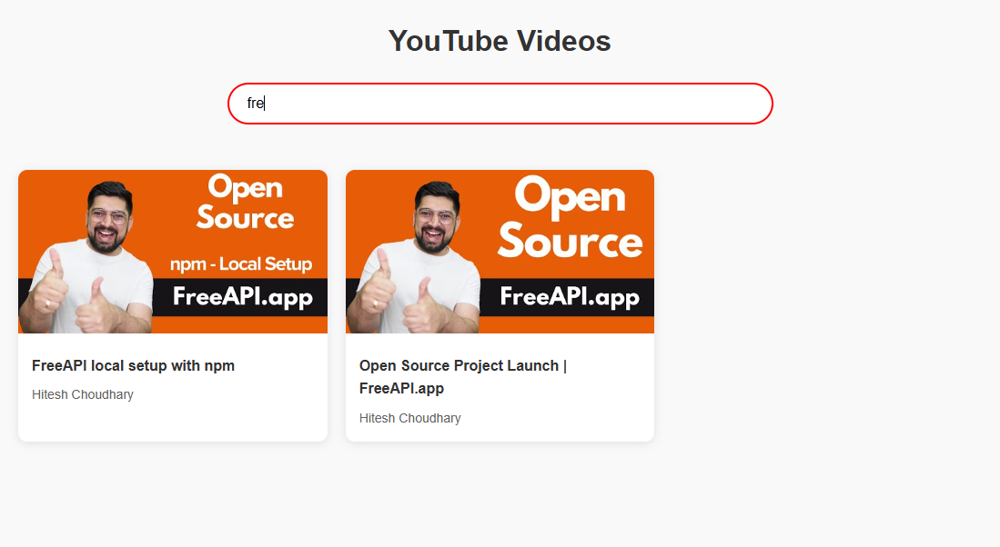

# YouTube Video Listing Application

A modern, responsive web application that displays YouTube videos in a grid layout with search functionality. Built with vanilla JavaScript and modern CSS.

## Features

- 🎥 **Video Grid Display**: Responsive grid layout showing YouTube videos
- 🔍 **Real-time Search**: Filter videos by title or channel name instantly
- 🖼️ **Thumbnail Preview**: High-quality video thumbnails
- 📱 **Responsive Design**: Works seamlessly on both desktop and mobile devices
- ⚡ **Fast Performance**: Client-side filtering for instant results
- 🎯 **Click to Watch**: Direct link to YouTube video playback

## Tech Stack

- HTML5
- CSS3 (with CSS Grid and CSS Variables)
- Vanilla JavaScript (ES6+)
- YouTube Data API

## Getting Started

### Prerequisites

- A modern web browser
- Internet connection to access the YouTube API

### Installation

1. Clone the repository:
```bash
git clone https://github.com/utkarshya24/ytvideos.git
```

2. Navigate to the project directory:
```bash
cd YTVideos
```

3. Open `index.html` in your web browser or use a local server:

## Usage

1. Open the application in your web browser
2. Videos will load automatically
3. Use the search bar to filter videos by title or channel name
4. Click on any video card to open it in YouTube

## API Integration

The application uses the FreeAPI YouTube endpoint:
```
GET https://api.freeapi.app/api/v1/public/youtube/videos
```

## Screenshots

### Desktop View


### Mobile View


### Search Functionality


## Deployment

The application is deployed at:
[Live Demo](https://yt-videos.vercel.app/)

## Contributing

1. Fork the repository
2. Create your feature branch (`git checkout -b feature/AmazingFeature`)
3. Commit your changes (`git commit -m 'Add some AmazingFeature'`)
4. Push to the branch (`git push origin feature/AmazingFeature`)
5. Open a Pull Request

## Acknowledgments

- FreeAPI for providing the YouTube video data
- YouTube for video content and thumbnails
 